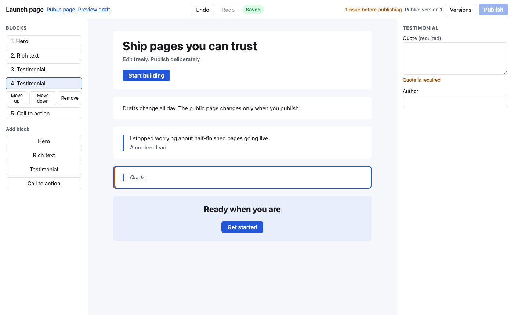
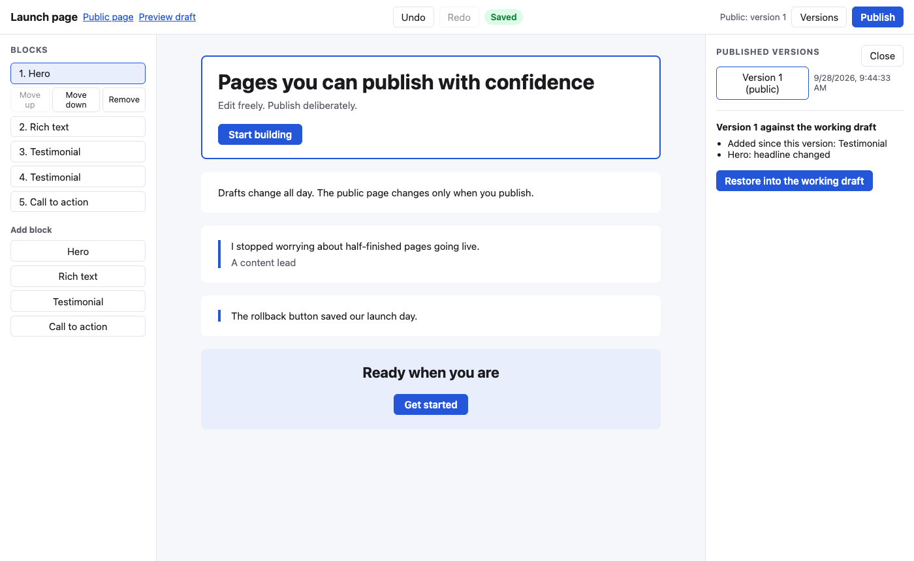
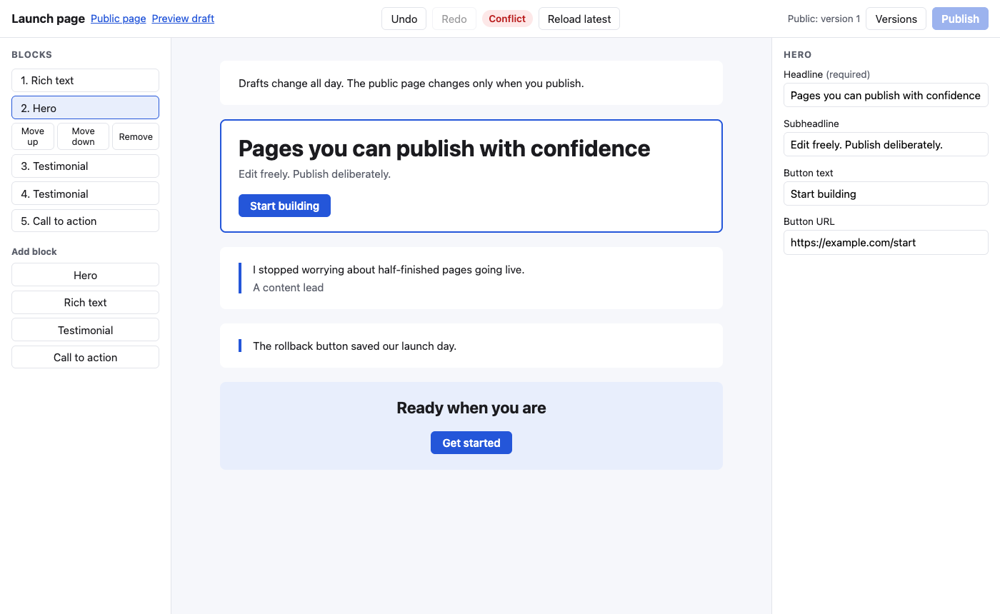

# Publishing Workbench

Publishing Workbench explores the boundary between a highly mutable editor and an immutable publishing system. Editing is intentionally flexible. Publication is intentionally strict. Drafts can change continuously, while the public renderer only accepts immutable snapshots.

It is a small Rails 8 application with a React and TypeScript block editor, built in a day to make one argument: a block editor has two different correctness problems, and the code should say so.

[](https://github.com/mateusgetulio/publishing-workbench/actions/workflows/ci.yml)

## The five guarantees

1. Drafts cannot leak into public rendering. The public route reads only published snapshots, and the public renderer raises if it is handed anything else.
2. Published snapshots are immutable. Once persisted, a snapshot cannot be updated or destroyed through the application.
3. Undo is structurally reversible. Every editor command returns its own inverse, and applying the inverse restores the exact previous document, block ids included.
4. Stale saves cannot silently overwrite newer drafts. Every save carries the revision it was based on, and a mismatch is a conflict the editor shows, never a lost update.
5. Public cache identity changes on publication, not on editing. The public page's ETag is the snapshot id plus the renderer version, so ten draft edits leave it untouched and one publish changes it.

## Demo







The two-minute script:

1. Open the public page in a second window. It shows version 1.
2. In the editor, change the hero headline, move the testimonial above the rich text, add a second testimonial. The status badge goes Unsaved, Saving, Saved. Until the new testimonial has a quote, the toolbar says "1 issue before publishing" and Publish stays disabled.
3. Refresh the public window. Nothing changed. The ETag in the network panel is still `"snapshot-1-renderer-v1"`.
4. Undo twice, redo twice. The added block comes back with the same id.
5. Publish. Refresh the public window. It changed, and the ETag is now `"snapshot-2-renderer-v1"`.
6. Open the editor in a second tab, edit there, then edit in the first tab. The first tab shows Conflict with "Reload latest". Nothing was overwritten.
7. Open Versions, select version 1, read the diff, restore it, publish. The public page is byte-identical to the original publication.

## How it works

### Data model

```
pages                 slug, title, current_published_snapshot_id
working_drafts        one per page: document (json), revision (optimistic concurrency only)
published_snapshots   append-only: document (json), source_revision, published_at
```

Autosave writes to the working draft and bumps its revision. That revision has no user-facing meaning; it exists so that a save based on revision 14 fails with 409 once someone else has produced revision 15. Version history is the list of published snapshots and nothing else, so saving ten times a minute never creates history.

### Two validation levels

Draft validation is structural: a `blocks` array, string ids, known block types, object props, unique ids. It runs on every save and protects the system. An empty required headline is a valid draft, because you are allowed to be halfway through a sentence.

Publish validation is the product rule set: required fields per block type, http or https URLs. It runs on publish and returns per-block issues. The editor mirrors it on the client so the toolbar can count issues while you type; the server stays authoritative. The client schema is a hand-written copy of the server's rules. In a production system one would be generated from the other.

### Publishing

Publish is one transaction: verify the working draft is at the expected revision, run publish validation, create the snapshot, point the page at it. Any failure leaves both the pointer and the snapshot count unchanged. Restore copies a snapshot's document into the working draft and bumps the revision; the snapshot itself is untouched.

### Rendering

`Rendering::DocumentHtml` turns a document into HTML from the document and `RENDERER_VERSION` alone: no timestamps, no request data, so two renders of one snapshot are byte-identical. `PublicRenderer` and `PreviewRenderer` are thin type guards over it: the first accepts only a `PublishedSnapshot`, the second only a `WorkingDraft`. The React canvas is an editing surface, not a renderer; the "Preview draft" link opens the server-rendered draft.

The public page sets `ETag: "snapshot-<id>-renderer-v<n>"` and answers `If-None-Match` with 304. Bump `RENDERER_VERSION` whenever the rendering templates or the public stylesheet change, because the body depends on them and the ETag does not track them by itself.

### The editor

Document changes go through four commands: add, remove, update and move a block. `apply(document, command)` returns the next document and the inverse command, computed at apply time, so undo is `apply(inverse)` and redo is `apply(command)` again. Block ids are client-generated UUIDs, which is why redo of an add keeps the same id. Undo and redo are session-local; any operation that replaces the document from the server (page load, conflict reload, restore) clears both stacks.

Autosave is single flight. An edit marks the editor dirty and arms an 800 ms timer. While a request is in flight, further edits set a pending flag instead of sending; when the response arrives, exactly one follow-up request goes out with the revision the server just returned. "Saved" means the document the server acknowledged is the document on screen, not merely that some response came back. A 409 stops autosave and offers a reload; a failed request keeps the local document and offers a retry. Publish is enabled only while the editor is saved, so you always publish what you are looking at.

Keyboard: Cmd or Ctrl+Z, Cmd or Ctrl+Shift+Z, Alt+Up, Alt+Down, Delete or Backspace on a selected block. Inside a text field all of those are left to the browser, so Backspace in a headline never deletes the hero.

## Invariants

| Id | Statement | Test |
|---|---|---|
| INV-1 | Applying a command's inverse restores the original document | `app/frontend/editor/commands.test.ts` (fast-check) |
| INV-2 | Undo then redo reproduces the post-command document, ids included | `app/frontend/editor/commands.test.ts` (fast-check) |
| INV-3 | Moving a block keeps the same set of blocks | `app/frontend/editor/commands.test.ts` (fast-check) |
| INV-4 | A saved document reads back structurally equal | `test/services/working_drafts/save_test.rb` (generated) |
| INV-5 | A stale expected revision is rejected and the stored document is unchanged | `test/services/working_drafts/save_test.rb` |
| INV-6 | One save in flight; exactly one follow-up with the returned revision | `app/frontend/editor/useSaveController.test.ts` |
| INV-7 | A publish that fails leaves the pointer and the snapshot count unchanged | `test/services/pages/publish_test.rb` |
| INV-8 | A persisted snapshot cannot be updated or destroyed | `test/models/published_snapshot_test.rb` |
| INV-9 | The public renderer refuses drafts; editing after publish leaves body and ETag identical | `test/lib/rendering/renderers_test.rb`, `test/controllers/public_pages_controller_test.rb` |
| INV-10 | Rendering the same snapshot twice is byte-identical | `test/lib/rendering/renderers_test.rb` (generated) |
| INV-11 | Restore reproduces the snapshot document, ids and order included | `test/services/pages/restore_test.rb` (generated) |
| INV-12 | A draft edit leaves the public ETag unchanged; a publish changes it | `test/controllers/public_pages_controller_test.rb` |

Generated tests are seeded. fast-check prints its seed on failure; the Rails generator reads `WORKBENCH_TEST_SEED`.

## Running it

Ruby 4.0 (pinned in `.ruby-version`), Node 22 (what CI runs), SQLite.

```
bin/setup          # bundle, npm install, database, then starts the server
bin/rails server   # afterwards, on http://localhost:3000
bin/ci             # bin/setup --skip-server, then RuboCop, ESLint, Prettier, tsc, bundler-audit, Brakeman, Rails tests, Vitest, seed replant
```

`bin/setup` seeds one page and publishes it through the real publish service, so the demo starts with a public version 1.

## What it does not do

- One page, no page creation, no authentication, no permissions, no tenancy.
- No collaborative editing. Concurrency detection exists because two tabs, a slow request or a retry can still race; resolution is reload only.
- No nested layouts, no image uploads, no drag and drop (move up and move down call the same command drag and drop would).
- The structural diff lists added, removed and changed blocks and the new order. It does not infer moves.
- Four block types. The prototype tests editor and publishing semantics, not a component library.
- SQLite. The row lock in the publish transaction is a no-op there; SQLite's immediate transactions provide the exclusion, and the code is ready for Postgres.
- Draft validation also rejects unknown property keys and non-string values, one step beyond "structural only", because the renderer depends on both.
- The client copy of the publish rules must be kept in sync with the server by hand.
- No deployment, no compaction of anything, no localization.

## What I would measure in production

- Save latency and the 409 rate per page, to tune the debounce and see how often conflicts really happen.
- Publish failures by reason (stale revision versus validation), to learn whether people publish what they think they are publishing.
- Restore frequency and how soon after a publish it happens, as a proxy for regret.
- Public cache hit ratio by ETag, to confirm that edits never invalidate and publishes always do.
